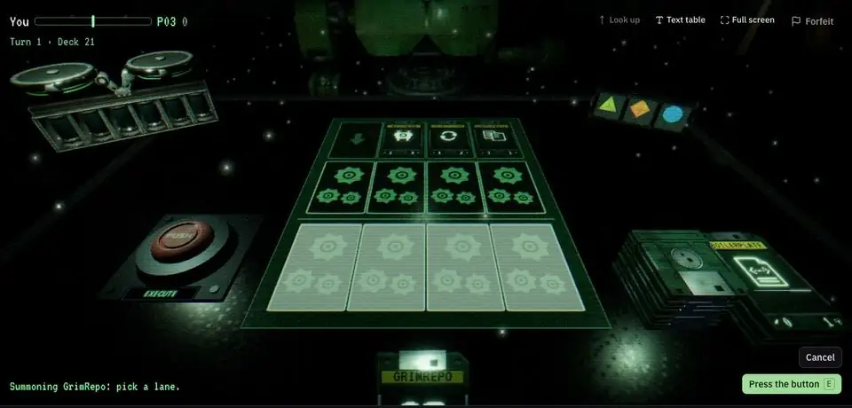
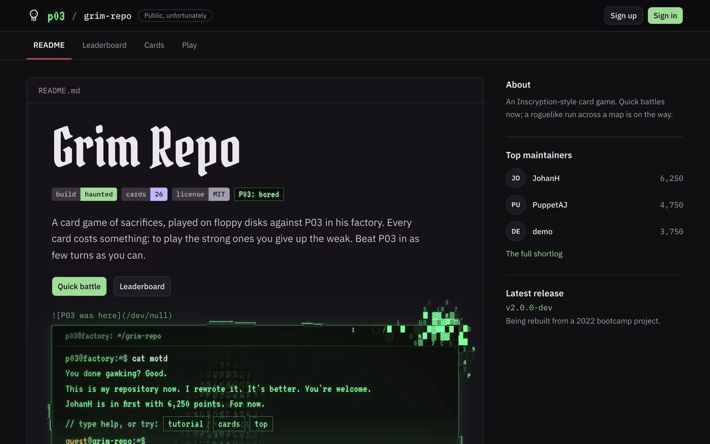
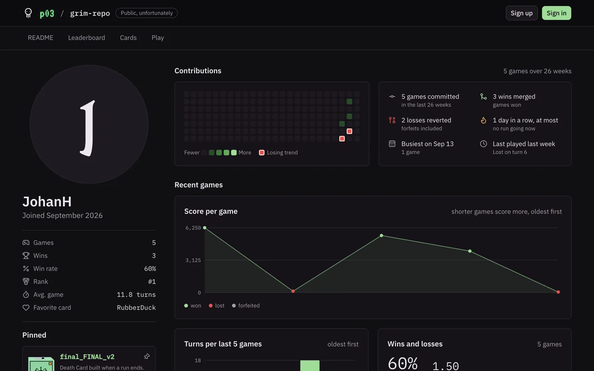
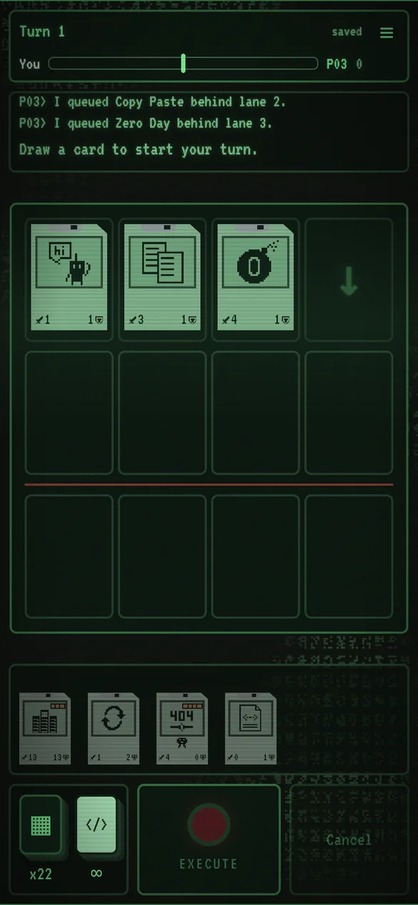
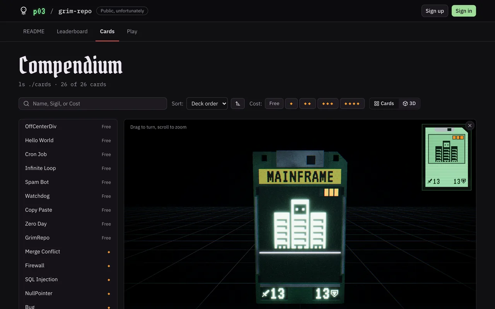

# Grim Repo

A card game of sacrifices, played on floppy disks against P03 in his factory. Inspired by [Inscryption](https://www.inscryption.com/), with a deck of programming jokes: every card costs something, and to play the strong ones you give up the weak.

It started in 2022 as a bootcamp group project (Express, Handlebars, MySQL and a single three.js script) and is rebuilt here as a portfolio project.

**Live: [grimrepo.up.railway.app](https://grimrepo.up.railway.app)**. Press **Quick battle** to play straight away as a guest, with no sign-up, or use the demo account button on the sign-in page.



- **A 3D table** in P03's factory, built with React Three Fiber. Every card is a floppy disk drawn from the game's data, and every move is played back: cards lunge, damage rises off what they hit, and the dead fold away.
- **Scores the server can trust.** Only moves are ever sent. The server replays them with the same rules engine the browser plays with, refuses an illegal one, and scores the finished game itself.
- **A text table as well,** laid out for phones held either way, which works with a screen reader.
- **P03 has broken in.** The README's screenshot tears into his terminal, which takes commands (`help`, `tutorial`, `cards`), and he has taken over first place on the leaderboard.
- **Profiles like GitHub's:** a contributions heatmap, charts of recent games, badges with rank and favorite card, and a pinned best game; and a compendium of every card, turning on its disk in 3D.

<table>
  <tr>
    <td width="36%"></td>
    <td width="36%"></td>
    <td width="28%" rowspan="2"></td>
  </tr>
  <tr>
    <td colspan="2"></td>
  </tr>
</table>

## How it works

- **One rules engine, used by both sides.** The rules are plain TypeScript in `shared`, with no browser or database in them, so they're tested in Node and run the same everywhere. A game is its seed and its moves: replaying them always gives the same state.
- **The server keeps the score.** A game's seed is chosen by the server. The browser saves the moves at each turn's end, and the server replays the whole game on every save, so an illegal move is refused and nothing is kept from it. A score can't be sent at all: it's computed once the replay reaches the end.
- **The table plays back events.** Each move reports what it did as a list of events (placed, attacked, damaged, killed), and both tables play them back one at a time. A unit test folds the events of whole games and checks they always land on the rules' own state.
- **Guests become players.** Quick battle signs a visitor in as a guest. If they sign up later, their games follow them into the account; guests stay off the leaderboard and are cleared out after a week.
- **Fast first load.** The home page is prerendered at build time with React's own `prerender`, so its first view arrives in the HTML, and three.js loads only when a 3D view is opened. A budget in the build fails it if a bundle outgrows its limit. Largest Contentful Paint on a simulated slow phone is 2.45 s.

## What it is built on

| Area     | Choice                                                                                    |
| -------- | ----------------------------------------------------------------------------------------- |
| Client   | Vite, React 19, React Router, Tailwind v4 and shadcn/ui; React Three Fiber for the table  |
| Server   | Express 5 on Node 24, which runs its TypeScript directly; Better Auth for accounts        |
| Rules    | A `shared` package of plain TypeScript used by both sides                                 |
| Database | Postgres 18, through `pg` and node-pg-migrate                                             |
| Tooling  | pnpm workspaces, TypeScript 7, oxlint, Prettier, Node's test runner, Playwright, axe-core |
| Hosting  | Railway, described in code in `.railway/railway.ts`; deploys only after CI passes         |

## Running it

You need Node 24 (`.node-version`), pnpm, and Docker for the database.

```sh
pnpm install
cp .env.example .env      # then put a real secret in BETTER_AUTH_SECRET: openssl rand -base64 32
pnpm db:up
pnpm db:migrate
pnpm db:seed
pnpm dev
```

The seed creates a demo account anyone can use, `demo` with the password `demo-password`, and the three original players with some games behind them.

The client is at http://localhost:3000 and proxies `/api` and `/health` to the API on port 3001. The database listens on 5433 so it can run beside another project's Postgres on 5432.

In development, `window.__game` exposes the 3D table's state and where things are on screen, and `/game?fixture=worst` loads a worst-case board to lay the tables out against. Neither exists in a production build.

## Tests

- **Unit tests** (`pnpm test`): the rules engine, including a bot that plays whole seeded games and a check that replay always agrees; the server's routes, auth, guests, rate limits and name filter against a real Postgres database whose name must end in `_test`; and the client's playback, table layout and P03's lines.
- **Browser suites** (`pnpm test:e2e`): plain Playwright scripts in `e2e/`, run in Chromium and Firefox. Smoke, auth, leaderboard, a whole game on the text table, the 3D table (clicking its models through `window.__game`), and an axe accessibility check of every page but the game on a laptop and a phone.
- **CI:** `ci.yml` runs lint, formatting, types, the unit tests and the build on every pull request and on `main`, and Railway deploys only once it passes. `browser.yml` runs every browser suite on pull requests, in both engines, against a production build.
- **The live site** (`pnpm test:prod`): a short check of the critical path after a deploy. It plays as a guest and signs nobody up.

## Scripts

| Script                        | Does                                                                                                                                                                    |
| ----------------------------- | ----------------------------------------------------------------------------------------------------------------------------------------------------------------------- |
| `pnpm dev`                    | Client and API together, reloading on change                                                                                                                            |
| `pnpm build`                  | Builds the client into `client/dist`, with the home page prerendered                                                                                                    |
| `pnpm start`                  | The API, serving the built client when `NODE_ENV=production`                                                                                                            |
| `pnpm lint` / `pnpm format`   | oxlint / Prettier                                                                                                                                                       |
| `pnpm typecheck`              | TypeScript across every package                                                                                                                                         |
| `pnpm test`                   | Unit tests in every package                                                                                                                                             |
| `pnpm test:e2e`               | The browser suites in Chromium and then Firefox, against `E2E_BASE_URL` (default http://localhost:3000); `pnpm test:e2e game --browser=firefox` runs one in one browser |
| `pnpm test:prod`              | The live site's critical path, or another production build's with `E2E_BASE_URL`                                                                                        |
| `pnpm db:up` / `pnpm db:down` | Start and stop the local Postgres                                                                                                                                       |
| `pnpm db:migrate`             | Apply the migrations in `server/migrations`                                                                                                                             |
| `pnpm db:seed`                | Wipe the database and reseed the demo state                                                                                                                             |
| `pnpm db:seed:empty`          | Seed only if there are no players yet; Railway runs this on every boot                                                                                                  |
| `pnpm db:cleanup`             | The nightly clean-up, by hand                                                                                                                                           |
| `pnpm moderate`               | Rename, remove, list or scan accounts; see Looking after the live site                                                                                                  |

The browser suites need `pnpm exec playwright install chromium firefox` once.

## How the code is arranged

```
client/   the web app
  src/game/table/   the 3D table: the factory, the disks, playback
  src/game/text/    the text table and its layouts
  src/pages/        the README, leaderboard, profiles, compendium and account pages
server/   the API, auth, migrations and the nightly clean-up
shared/   game rules and data, imported by both
e2e/      browser suites, plain Playwright scripts
```

Imports run one way, and oxlint enforces it: the client and the server may use `shared`, `shared` uses neither, and neither imports the other.

## The API

| Route                              | Does                                                                                                   |
| ---------------------------------- | ------------------------------------------------------------------------------------------------------ |
| `/api/auth/*`                      | Sign up, sign in by email or username or as a guest, rename, delete the account, sign out; Better Auth |
| `GET /api/me`                      | The signed-in player, their best score and games played                                                |
| `POST /api/games`                  | Starts a game with a seed the server picks, or resumes the unfinished one                              |
| `POST /api/games/:id/moves`        | Saves the moves since the last save; the server replays the whole game, and scores it once it is over  |
| `POST /api/games/:id/forfeit`      | Walks away: a loss on the turn reached                                                                 |
| `GET /api/leaderboard?page=`       | Players ranked by their best game, twenty to a page; guests are left off                               |
| `GET /api/players/:username/stats` | A player's record: wins, losses, rank, favorite card, best game, recent games                          |
| `GET /api/players/:username/games` | A player's whole history, ten games to a page                                                          |

Every figure is computed from the stored games, and a player can only ever be shown under their own username. Sign-in attempts are rate limited by the client's real address, and games per player.

## Looking after the live site

Names are filtered when they are chosen: profanity from the [obscenity](https://github.com/jo3-l/obscenity) dataset and the [List of Dirty, Naughty, Obscene and Otherwise Bad Words](https://github.com/LDNOOBW/List-of-Dirty-Naughty-Obscene-and-Otherwise-Bad-Words), playground words those lists leave out, and names that would pass for the game or its staff. It sees through underscores, camelCase, digits in place of letters and doubled letters. Anything that slips through is fixed from the command line. Locally:

```sh
pnpm moderate recent 7              # accounts made in the last 7 days
pnpm moderate rename <username>     # rename to a neutral player_####, and lock the name
pnpm moderate remove <username>     # delete the account and its games
pnpm moderate scan                  # existing names the filter would refuse today
```

Against the live site, the same commands run inside the app's container:

```sh
pnpm exec railway ssh --service GrimRepo -- pnpm moderate rename <username>
```

A clean-up runs every night at 04:00 UTC as its own Railway service. It clears the shared demo account's open game, drops games abandoned for a month, and sweeps expired sessions and old rate-limit rows. `pnpm db:cleanup` runs it by hand. Scores are kept: every one is a replayed game, so there is nothing to reset.

## Future plans

- **Five lanes.** P03's board in Inscryption's third act is five lanes wide. Grim Repo keeps four for now: every encounter and boss is tuned to four, and five cards across is tight on a phone. The rules engine counts lanes in one place, so a fifth is mostly a matter of the 3D board, the camera views and a rebalance.
- **Conduits.** Act 3's conduit cards power the cards between them. A fifth lane would leave room for three cards between two conduits, where four lanes leaves two, so conduits would come with it.
- **A challenge ladder.** Optional rules that make a run harder for a higher score, unlocked one level at a time, as in Kaycee's Mod. Designed, but set aside until enough players come back for more runs.

## Credits

Built by Adrian Jimenez, rewritten from his 2022 bootcamp project ([original repository](https://github.com/kwm0304/Boss-fight)).

- **P03:** [Inscryption P03 V2](https://sketchfab.com/3d-models/inscryption-p03-v2-2c8ec018120544aca51b2790973fc484) by p03_real_account (CC BY 4.0), wearing the color and metal maps from [P03](https://sketchfab.com/3d-models/p03-98b40954748447be81f2bb713f6b28b8) by Goober (CC BY 4.0), and rigged at the head and arm.
- **P03's tools:** [Inscryption Hammer](https://sketchfab.com/3d-models/inscryption-hammer-902459fefad2475eaca4f018c4ec1f4a) and [Inscryption pliers](https://sketchfab.com/3d-models/inscryption-pliers-20a227573b4e4e9a83023f3f0daed0fd) by p03_real_account (CC BY 4.0).
- **P03's faces:** [Inscryption P03 faces](https://sketchfab.com/3d-models/inscryption-p03-faces-4318168b0c3e4c0a8a1ced18927332a8) by p03_real_account (CC BY 4.0), turned white on black for the 3D screens.
- **The battery:** [Inscryption Act 3 battery and counter](https://sketchfab.com/3d-models/inscryption-act-3-battery-and-counter-9f65d14097f74a1b9885272b9d2b6a58) by p03_real_account (CC BY 4.0), split into the battery and the gem module.
- **The button's cap:** from [Scifi button](https://sketchfab.com/3d-models/scifi-button-8dcd82d477e441d7b6789f1851924b5f) by lorib2306 (CC BY 4.0), cut from its stand.
- **The ceiling light:** [Weathered Fluorescent Light/Lamp](https://sketchfab.com/3d-models/weathered-fluorescent-lightlamp-07c2805b50b6476f8e0ad467fae00b82) by Mark Peters (CC BY 4.0).
- **The items:** [Scissors](https://sketchfab.com/3d-models/scissors-6e0defc85edc4920a794fe9e82b5f16b) by sweedboy69, [Hourglass](https://sketchfab.com/3d-models/hourglass-a453e90d47b74260b5e5ccd5a965fe3e) by Less, [Hook](https://sketchfab.com/3d-models/hook-6f36616001cf4037b104cca4967f5027) by lakeap1, and the bottle from [Inscryption Goobert](https://sketchfab.com/3d-models/inscryption-goobert-2bac07d9276c4e38b1461951fe0d5ace) by p03_real_account, with Goobert taken out (all CC BY 4.0); each simplified and resized for the table. The Hammer and Pliers are P03's tools above.
- **The run's projector:** [Hologram projector with hologram](https://sketchfab.com/3d-models/hologram-projector-with-hologram-ca0a3bc92a3d4a3f9b0fa19cbc73b420) by t.flores (CC BY 4.0), without its hologram, which the game draws itself.
- **The factory's metal:** Metal029, DiamondPlate008C and CorrugatedSteel005 from [ambientCG](https://ambientcg.com) (CC0).
- **The cards:** Adrian Jimenez's 1-bit pixel art, drawn for the rebuild in a sprite editor made for it; it replaced the 2022 card art.
- **The name filter:** word lists from [obscenity](https://github.com/jo3-l/obscenity) (MIT) and [LDNOOBW](https://github.com/LDNOOBW/List-of-Dirty-Naughty-Obscene-and-Otherwise-Bad-Words) (CC BY 4.0).
- **Fonts:** IBM Plex Sans and Plex Mono, VT323 and Pirata One (all SIL Open Font License), through [Fontsource](https://fontsource.org).
- **The game** is a tribute to Inscryption by Daniel Mullins Games.

## License

MIT. See [LICENSE](./LICENSE).
